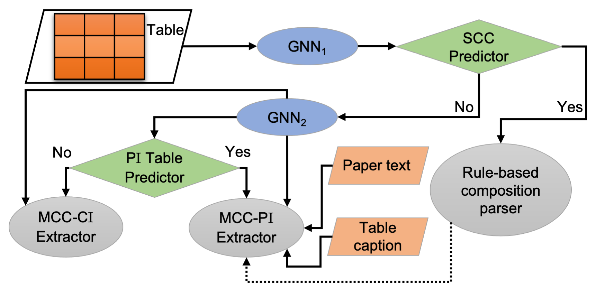

# DiSCoMaT: Distantly Supervised Composition Extraction from Tables in Materials Science

## About
This repository contains the official implementation of 
[DiSCoMaT: Distantly Supervised Composition Extraction from Tables in Materials Science](https://arxiv.org/abs/2207.01079). This model is trained on **4,408 distantly supervised tables** published in materials science research papers to extract compositions reported in the tables. These tables yielded a total of 38,799 tuples in the training set.

The tuples are of the form $\{(id, c_k^{id}, p_k^{id}, u_k^{id} )\}_{k=1}^{K^{id}}$, where
- $id$ is the id of the material composition reported in the tables
- $c_k^{id}$ is the k-th chemical element in the material composition
- $p_k^{id}$ is the percentage of k-th chemical element in the material composition
- $u_k^{id}$ is the unit of the of $p_k^{id}$ (either mole % or weight %)


The following figure represents the architecture of the model proposed in our work.



## Notes
- The [**code**](code) directory contains the file for training models reported in this paper.
- The [**data**](data) directory contains the dataset for training models reported in this paper.
- The [**notebooks**](notebooks) directory contains Jupyter notebook to visualise the dataset.
- The respective directories and sub-directories contain task-specific **README** files.

## Citation
If you find this repository useful, please cite our work as follows:
```
Incoming ACL 2023. Will be added soon.
```
